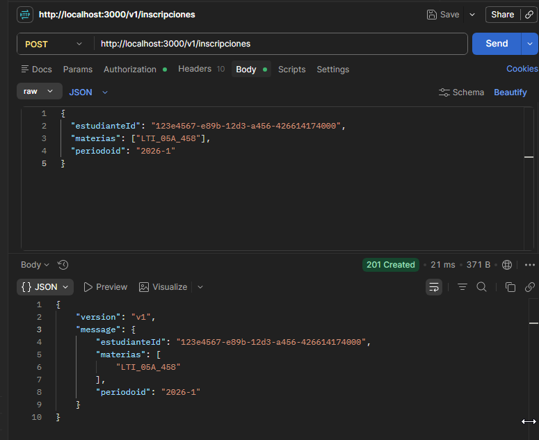
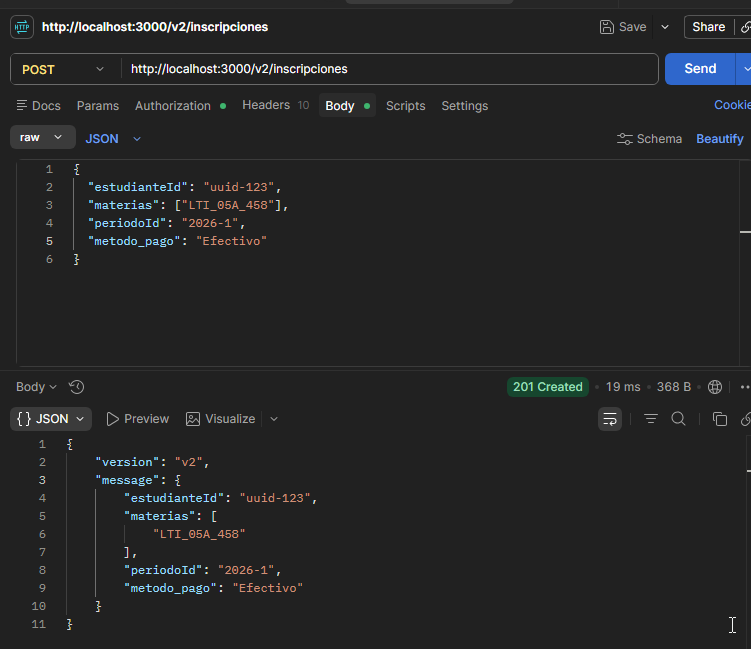
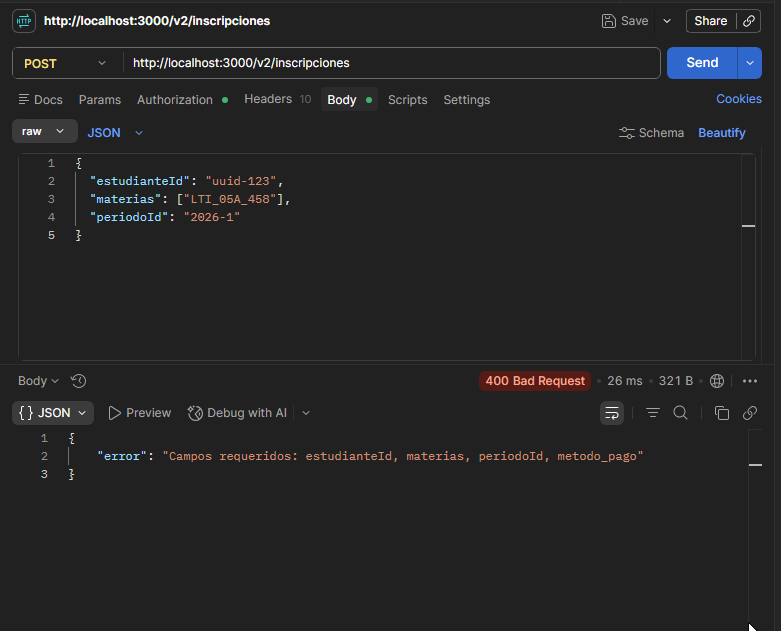
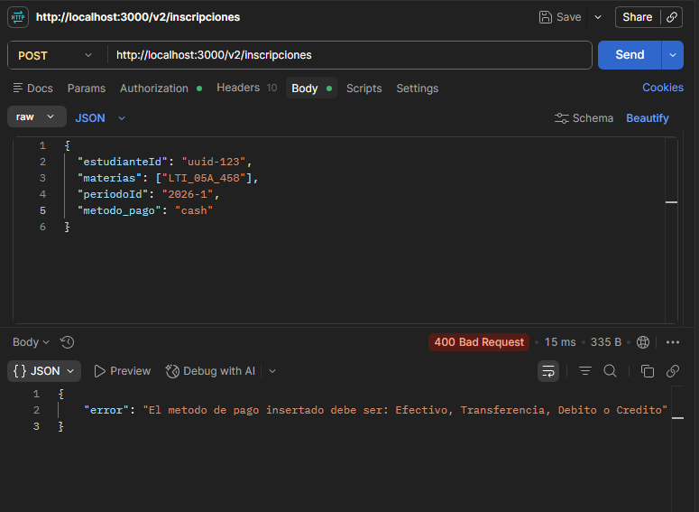

(a) Sin API key -> Esperado: 401
Comando:
  curl.exe http://localhost:3000/health

Salida Real: {"error":"API key inválida o ausente"}
Explicación: El middleware de autenticación bloquea la petición inmediatamente al no detectar la cabecera requerida.

(b) Con clave válida -> Esperado: 200
Comando:

curl.exe -H "x-api-key: secreto-demo" http://localhost:3000/health
Salida Real:

{"status":"ok","ts":"2026-06-11T17:11:22.730Z"}
Explicación: La API Key es correcta, el middleware permite el paso y el endpoint responde con el estado del servidor.

(c) Ruta inexistente -> Esperado: 404
Comando:

curl.exe -H "x-api-key: secreto-demo" http://localhost:3000/noexiste
Salida Real:

<!DOCTYPE html>
<html lang="en">
<head>
<meta charset="utf-8">
<title>Error</title>
</head>
<body>
<pre>Cannot GET /noexiste</pre>
</body>
</html>

Explicación: La autenticación se valida correctamente, pero Express retorna su página de error HTML nativa con un estado 404 porque la ruta /noexiste no está declarada.


> middleware-pe21@1.0.0 test
> cross-env NODE_OPTIONS=--experimental-vm-modules jest

(node:15556) ExperimentalWarning: VM Modules is an experimental feature and might change at any time
(Use `node --trace-warnings ...` to show where the warning was created)
 PASS  src/middlewares/auth.test.ts
(node:15216) ExperimentalWarning: VM Modules is an experimental feature and might change at any time
(Use `node --trace-warnings ...` to show where the warning was created)
 PASS  src/middlewares/logger.test.ts

Test Suites: 2 passed, 2 total
Tests:       5 passed, 5 total
Snapshots:   0 total
Time:        1.631 s
Ran all test suites.


Endpoint documentado: GET /health
Método HTTP

GET /health

Descripción

Verifica que el servidor esté funcionando correctamente.

Autenticación

Header obligatorio:

x-api-key: secreto-demo

Parámetros de entrada

No requiere parámetros de ruta, query ni cuerpo (body).

Respuesta exitosa (200)
{
  "status": "ok",
  "ts": "2026-06-11T17:11:22.730Z"
}

Campos:

status: estado del servidor.
ts: fecha y hora en formato ISO 8601.
Error 401 Unauthorized
{
  "error": "API key inválida o ausente"
}

Se produce cuando el cliente no envía la cabecera x-api-key o su valor es incorrecto.

## Versionado

### Cambio compatible 


Antes:

```json
{
  "status": "ok",
  "ts": "2026-06-11T17:11:22.730Z"
}
```

Después:

```json
{
  "status": "ok",
  "ts": "2026-06-11T17:11:22.730Z",
  "version": "1.0.0"
}
```

Justificación:
Los clientes existentes seguirán funcionando porque los campos originales permanecen sin cambios y el nuevo campo es opcional.

### Cambio incompatible

Cambiar el tipo del campo status.

Antes:

```json
{
  "status": "ok"
}
```

Después:

```json
{
  "status": true
}
```

Justificación:
Los clientes esperan una cadena de texto. Al recibir un valor booleano podrían fallar validaciones y procesos de deserialización.

README.md — sección Pruebas (Markdown):
## Pruebas de los endpoints

Servidor corriendo en `http://localhost:3000`. Autenticacion: header `x-api-key: secreto-demo`.

### Escenario 1 — POST /v1/inscripciones con campos válidos (esperado: 201)



### Escenario 2 — POST /v2/inscripciones con payment_method válido (esperado: 201)



### Escenario 3 — POST /v2/inscripciones sin payment_method (esperado: 400)



### Escenario 4 — POST /v2/inscripciones con payment_method inválido (esperado: 400)


